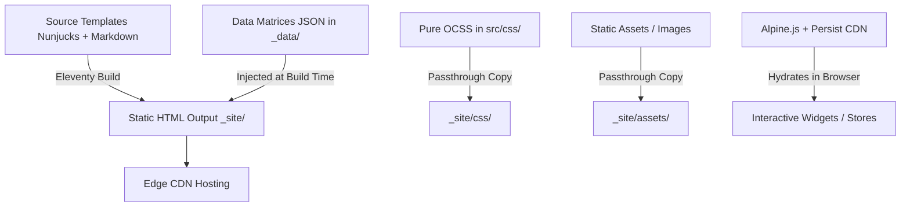

# Architecture & Technical Design: Camwyn & Co

## 1. System Topology & Paradigm
Camwyn & Co is architected as a **Pure Static Site (Jamstack / SSG)** with zero backend server dependencies at runtime.



## 2. Layer Definitions

### Pre-renderer / SSG Layer: Eleventy (11ty) v3.x
- **Template Engine:** Nunjucks (`.njk`).
- **Configuration:** `.eleventy.js`.
- **Server Options:** Development server configured with `showAllHosts: true` and `port: 8080` for Docker/Lando compatibility.
- **Directory Structure:**
  - `input`: `src`
  - `output`: `_site`
  - `includes`: `src/_includes`
  - `data`: `src/_data`

### Reactivity & State Layer: Alpine.js v3.x + `@alpinejs/persist`
- Loaded via CDN script tags with `defer`.
- Global state managed in `Alpine.store('compass', ...)`.
- Persists quiz answers and resulting archetype in `localStorage` under `compassResult` and `compassHistory`.
- Fallback integrity: Default HTML is rendered on the server so that non-JS user agents and crawlers see complete content before hydration.

### Styling Layer: Pure OCSS + CSS Custom Properties
- **No Build Tools:** No Tailwind, PostCSS, Sass, or CSS-in-JS.
- **Token-Driven:** All colors, typography, and spacing defined as CSS variables in `src/css/01-settings/tokens.css`.
- **Structure:**
  - `01-settings/`: Tokens, typography scales, colors.
  - `02-objects/`: Grid, container, flow layout primitives.
  - `03-components/`: Sidenav, Hero, Compass quiz card, Note cards, Project rows.
  - `04-utilities/`: Accessibility helpers, typography overrides, spacing.

## 3. Directory Layout
```
src/
├── _data/              # Global JSON data matrices (compass.json, fieldNotes.json, site.json)
├── _includes/          # Partials and base layouts (base.njk, sidenav.njk, compass.njk, etc.)
├── css/                # OCSS styling hierarchy
├── assets/             # Images, vector logos, favicons
├── index.njk           # Homepage template
├── our-story.njk       # Our Story template
└── what-we-do.njk      # What We Do template
```

